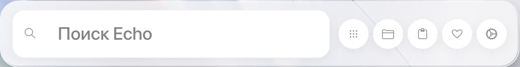
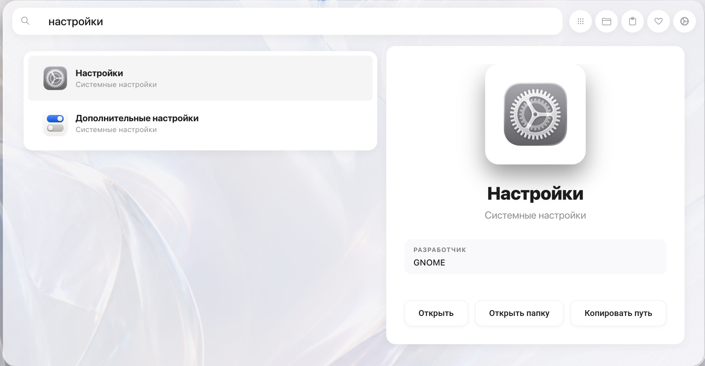
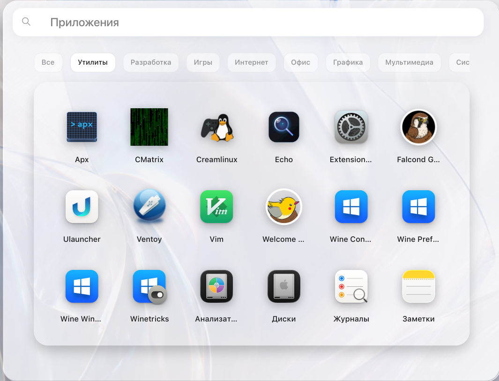
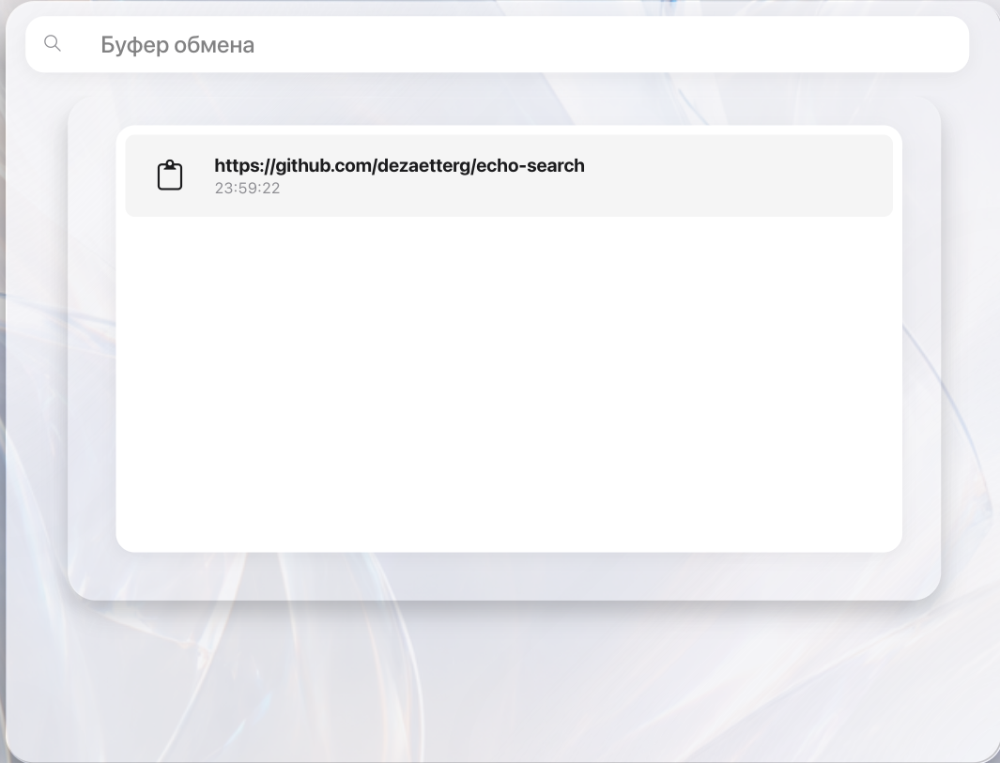
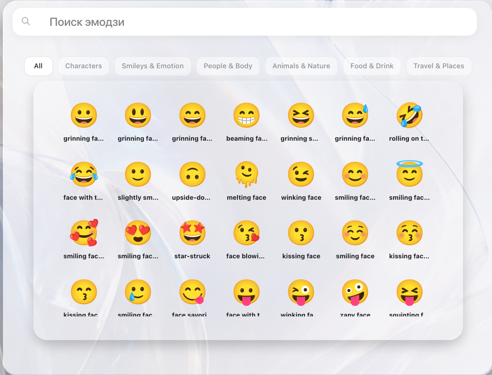
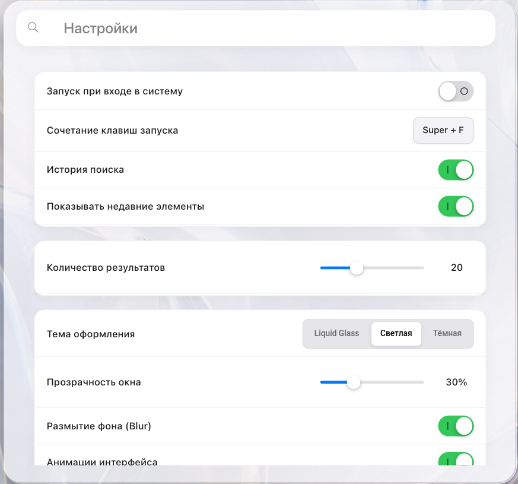

<div align="center">


# Echo Search

**Современный быстрый лаунчер приложений и файлов для Linux с интерфейсом Liquid Glass (GTK 4 / Wayland / X11)**

[](https://github.com/dezaetterg/echo-search/releases)
[](LICENSE)
[](https://github.com/dezaetterg/echo-search)
[](https://www.gtk.org/)

<br>



</div>

## Возможности

* **Поиск приложений**: запуск установленных `.desktop` программ с нечетким (fuzzy) поиском и автоматической транслитерацией ошибочной раскладки клавиатуры.
* **Поиск файлов**: поиск документов и медиафайлов через GNOME Tracker 3 SPARQL с фильтрацией по типам (документы, изображения, видео, аудио, архивы).
* **История буфера обмена**: хранение и поиск недавних фрагментов текста с панелью предпросмотра (поддержка `wl-clipboard` на Wayland и `xclip` на X11).
* **Калькулятор и конвертер**: подсчет математических выражений и перевод единиц измерения прямо в строке ввода.
* **Поиск эмодзи**: встроенная библиотека символов и эмодзи с фильтрацией по категориям и поиском.
* **Интерфейс Liquid Glass**: полупрозрачный стеклянный дизайн с размытием фона, плавными анимациями и поддержкой светлой/темной темы.
* **Встроенные настройки**: удобная панель конфигурации тем оформления, прозрачности, глобальных хоткеев и модулей поиска прямо внутри лаунчера.
* **Мультиязычный ввод**: глобальные сочетания клавиш работают на любых раскладках клавиатуры (EN / RU).

## Скриншоты интерфейса

| Поиск и панель предпросмотра | Сетка приложений и категории |
| :---: | :---: |
|  |  |
| **История буфера обмена** | **Поиск эмодзи и символов** |
|  |  |

<br>

<div align="center">
  <h3>Встроенные настройки и персонализация</h3>
  
</div>

## Совместимость и тестирование

* **Дистрибутивы**: приложение разрабатывалось и тестировалось на Debian-based системах: **PikaOS**, **Debian 13 (Trixie)** и **Linux Mint**. Пакеты для Arch Linux и Fedora сгенерированы по спецификациям.
* **Окружения рабочего стола**: протестировано на **GNOME** и **Cinnamon**. В теории поддерживаются все современные окружения (KDE Plasma, XFCE, Hyprland, Sway).

## Установка

### 1. Универсальный установщик
Скрипт проверяет пакетный менеджер, ставит системные зависимости и настраивает вызов по **Super + Space**:

```bash
git clone https://github.com/dezaetterg/echo-search.git
cd echo-search
chmod +x install.sh
./install.sh
```

### 2. Debian / Ubuntu / Linux Mint / PikaOS (.deb)
Готовый `.deb` пакет доступен на странице **[Releases](https://github.com/dezaetterg/echo-search/releases)**:

```bash
# Если файл скачан через браузер:
sudo apt install ~/Загрузки/echo-search_*.deb || sudo apt install ~/Downloads/echo-search_*.deb

# Либо одной командой через терминал:
wget -O /tmp/echo-search.deb https://github.com/dezaetterg/echo-search/releases/latest/download/echo-search_1.0.7_all.deb
sudo apt install /tmp/echo-search.deb
```

### 3. Arch Linux / Manjaro
Сборка локального пакета через `makepkg`:

```bash
git clone https://github.com/dezaetterg/echo-search.git
cd echo-search
makepkg -si
```

### 4. Fedora / openSUSE / RHEL
Установка через универсальный установщик или сборка локального RPM:

```bash
git clone https://github.com/dezaetterg/echo-search.git
cd echo-search
chmod +x install.sh
./install.sh
```

### 5. Запуск из исходного кода
```bash
python3 main.py
```

### Если пакеты или репозитории недоступны (Linux Mint / Ubuntu)

Если система сообщает, что пакеты GTK4 или зависимости не найдены, включите репозиторий `universe`:

```bash
sudo add-apt-repository universe
sudo apt update
```

## Управление

* `Super + Space` (или настроенный вами хоткей): открыть или скрыть окно
* `Стрелки вверх / вниз` : навигация по результатам
* `Enter` : запустить программу или открыть файл
* `Tab` : переключение между категориями
* `Esc` : очистить ввод или закрыть окно

## Конфигурация

Файл настроек создается автоматически при первом запуске:
`~/.config/echo-search/config.json`

Все параметры также можно легко менять прямо через встроенную панель настроек в правом верхнем углу лаунчера (кнопка ⚙️).

## Зависимости

* Python 3.10+
* GTK 4, Libadwaita, Gtk4LayerShell
* Rapidfuzz
* GNOME Tracker 3 (опционально для глубокого поиска файлов)
* `wl-clipboard` или `xclip` (для буфера обмена)

## Лицензия

GNU General Public License v3.0 (GPLv3). Подробнее в файле [LICENSE](LICENSE).

Автор: **[@dezaetterg](https://github.com/dezaetterg)**
